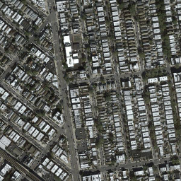
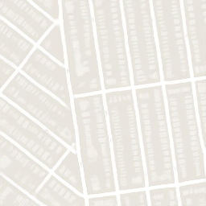
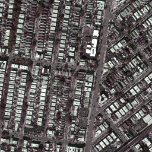
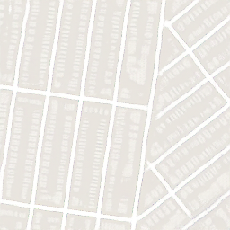

## Pix2Pix

Resources and papers

[Image-to-Image Translation With Conditional Adversarial Networks](https://arxiv.org/pdf/1611.07004v3.pdf)

[深度学习系列（四）分割网络模型（FCN、Unet、Unet++、SegNet、RefineNet)](https://mp.weixin.qq.com/s?__biz=MzUxNTY1MjMxNQ==&mid=2247484343&idx=1&sn=2cd6eccf9657bdfd60f50d044012370a&chksm=f9b22c03cec5a515bf56a731fb1392f829fa7929e67c6d54d6e78d39c3db4faf48300a971bb5&scene=178&cur_album_id=1338176739859857409#rd)

Pix2pix是用CGAN做图像转换image translation的鼻祖，图像转换是从输入图像的像素到输出图像像素的映射，通常用CNN卷积神经网络来缩小欧式距离，但会导致输出图像的模糊问题，pix2pix利用GAN完成成对图像的转换。

Pix2pix的网络框架如下，原理和CGAN类似


生成器采用Unet结构，输入目标轮廓，经过编码解码生成着色的目标图像，判别器采用PatchGan对生成假图像和真实图像进行判别，把图像分成切片patch，分别判断每个patch的真假，再平均最后的结果，作者采用的patch大小为70x70。


通常情况下的CGAN目标函数为

$$\mathcal{L}_{cGAN}(G,\,D)=\mathbb{E}_{x,\,y}[\log D(x,\,y)]+\mathbb{E}_{x,\,z}[\log(1-D(x,\,G(x,\,z)))]$$

Pix2pix中增加了一个L1 Loss一起优化目标函数

$$\mathcal{L}_{L1}(G)=\mathbb{E}_{x,\,y,\,z}[\|y-G(x,\,z)\|_1]$$

$$\displaystyle G^*=\arg\min_G\max_D\mathcal{L}_{cGAN}(G,\,D)+\lambda\mathcal{L}_{L1}(G)$$

使用传统的L1 loss来让生成的图片跟训练的图片尽量相似，用GAN来构建高频部分的细节。

Pix2pix的缺点在于，使用这样的结构其实学到的是 $x$ 到 $y$ 之间的一对一映射，也就说，pix2pix就是对ground truth的重建：输入轮廓图→经过Unet编码解码成对应的向量→解码成真实图。这种一对一映射的应用范围十分有限，当我们输入的数据与训练集中的数据差距较大时，生成的结果很可能就没有意义。

## Networks

### Discriminator

```python
class CNNBlock(nn.Module):
    def __init__(self, in_channels, out_channels, stride=2):
        super().__init__()
        self.conv = nn.Sequential(
            nn.Conv2d(in_channels, out_channels, 4, stride, 1, bias=False, padding_mode="reflect"),
            nn.BatchNorm2d(out_channels),
            nn.LeakyReLU(0.2)
        )

    def forward(self, x):
        return self.conv(x)
```

```python
class Discriminator(nn.Module):
    def __init__(self, in_channels=3, features=None):  # 256 -> 30 x 30
        super().__init__()
        if features is None:
            features = [64, 128, 256, 512]

        self.initial = nn.Sequential(
            nn.Conv2d(in_channels * 2, features[0], kernel_size=4, stride=2, padding=1, padding_mode="reflect"),
            nn.LeakyReLU(0.2)
        )

        layers = []
        in_channels = features[0]
        for feature in features[1:]:
            layers.append(CNNBlock(in_channels, feature, stride=1 if feature == features[-1] else 2))
            in_channels = feature
        layers.append(nn.Conv2d(in_channels, 1, kernel_size=4, stride=1, padding=1, padding_mode="reflect"))

        self.model = nn.Sequential(*layers)

    def forward(self, x, y):
        x = torch.cat([x, y], dim=1)
        x = self.initial(x)
        return self.model(x)
```

### Generator

```python
class Block(nn.Module):
    def __init__(self, in_channels, out_channels, down=True, act="relu", use_dropout=False):
        super().__init__()
        self.conv = nn.Sequential(
            nn.Conv2d(in_channels, out_channels, 4, 2, 1, bias=False, padding_mode="reflect") if down else
            nn.ConvTranspose2d(in_channels, out_channels, 4, 2, 1, bias=False),
            nn.BatchNorm2d(out_channels),
            nn.ReLU() if act == "relu" else nn.LeakyReLU(0.2)
        )
        self.use_dropout = use_dropout
        self.dropout = nn.Dropout(0.5)

    def forward(self, x):
        x = self.conv(x)
        return self.dropout(x) if self.use_dropout else x
```

```python
class Generator(nn.Module):
    def __init__(self, in_channels=3, features=64):
        super().__init__()
        self.initial_down = nn.Sequential(
            nn.Conv2d(in_channels, features, 4, 2, 1, padding_mode="reflect"),
            nn.LeakyReLU(0.2)
        )
        self.down1 = Block(features, features * 2, down=True, act="leaky", use_dropout=False)
        self.down2 = Block(features * 2, features * 4, down=True, act="leaky", use_dropout=False)
        self.down3 = Block(features * 4, features * 8, down=True, act="leaky", use_dropout=False)
        self.down4 = Block(features * 8, features * 8, down=True, act="leaky", use_dropout=False)
        self.down5 = Block(features * 8, features * 8, down=True, act="leaky", use_dropout=False)
        self.down6 = Block(features * 8, features * 8, down=True, act="leaky", use_dropout=False)
        self.bottleneck = nn.Sequential(
            nn.Conv2d(features * 8, features * 8, 4, 2, 1, padding_mode="reflect"),
            nn.ReLU()
        )
        self.up1 = Block(features * 8, features * 8, down=False, act="relu", use_dropout=True)
        self.up2 = Block(features * 8 * 2, features * 8, down=False, act="relu", use_dropout=True)
        self.up3 = Block(features * 8 * 2, features * 8, down=False, act="relu", use_dropout=True)
        self.up4 = Block(features * 8 * 2, features * 8, down=False, act="relu", use_dropout=False)
        self.up5 = Block(features * 8 * 2, features * 4, down=False, act="relu", use_dropout=False)
        self.up6 = Block(features * 4 * 2, features * 2, down=False, act="relu", use_dropout=False)
        self.up7 = Block(features * 2 * 2, features, down=False, act="relu", use_dropout=False)
        self.final_up = nn.Sequential(
            nn.ConvTranspose2d(features * 2, in_channels, kernel_size=4, stride=2, padding=1),
            nn.Tanh()
        )

    def forward(self, x):
        d1 = self.initial_down(x)
        d2 = self.down1(d1)
        d3 = self.down2(d2)
        d4 = self.down3(d3)
        d5 = self.down4(d4)
        d6 = self.down5(d5)
        d7 = self.down6(d6)
        bottleneck = self.bottleneck(d7)
        up1 = self.up1(bottleneck)
        up2 = self.up2(torch.cat([up1, d7], 1))
        up3 = self.up3(torch.cat([up2, d6], 1))
        up4 = self.up4(torch.cat([up3, d5], 1))
        up5 = self.up5(torch.cat([up4, d4], 1))
        up6 = self.up6(torch.cat([up5, d3], 1))
        up7 = self.up7(torch.cat([up6, d2], 1))
        return self.final_up(torch.cat([up7, d1], 1))
```

## Results





## Datasets

### Maps dataset

The dataset can be downloaded from Kaggle: [link](https://www.kaggle.com/vikramtiwari/pix2pix-dataset).

### Anime dataset

The dataset can be downloaded from Kaggle: [link](https://www.kaggle.com/ktaebum/anime-sketch-colorization-pair).

## Read-through: pix2pix

### Abstract

We investigate **conditional adversarial networks as a general-purpose solution** to image-to-image translation problems. These networks **not only learn the mapping from input image to output image, but also learn a loss function** to train this mapping. This makes it possible to apply the same generic approach to problems that traditionally would require very different loss formulations. We demonstrate that this approach is effective at synthesizing photos from label maps, reconstructing objects from edge maps, and colorizing images, among other tasks. As a community, we **no longer hand-engineer our mapping functions**, and this work suggests we can achieve reasonable results **without hand-engineering our loss functions** either.

### Introduction

If we take a naive approach and ask the CNN to minimize the Euclidean distance between predicted and ground truth pixels, **it will tend to produce blurry results**. This is because Euclidean distance is minimized by averaging all plausible outputs, which causes blurring. Coming up with loss functions that force the CNN to do what we really want – e.g., output sharp, realistic images – is an open problem and generally requires expert knowledge.

It would be highly desirable if we could **instead specify only a high-level goal, like “make the output indistinguishable from reality”**, and then **automatically learn a loss function** appropriate for satisfying this goal.

### Method

#### Objective

The objective of a conditional GAN can be expressed as

$$\mathcal{L}_{cGAN}(G,\,D)=\mathbb{E}_{x,\,y}[\log D(x,\,y)]+\mathbb{E}_{x,\,z}[\log(1-D(x,\,G(x,\,z)))],$$

where G tries to minimize this objective against an adversarial D that tries to maximize it, i.e. $G^*=\arg\min_G\max_D\mathcal{L}_{cGAN}(G,\,D)$.

Previous approaches have found it beneficial to mix the GAN objective with a more traditional loss, such as L2 distance. The discriminator’s job remains unchanged, but the generator is tasked to not only fool the discriminator but also to be near the ground truth output in an L2 sense. We also explore this option, **using L1 distance rather than L2 as L1 encourages less blurring**:

$$\mathcal{L}_{L1}(G)=\mathbb{E}_{x,\,y,\,z}[\|y-G(x,\,z)\|_1].$$

Our final objective is

$$\displaystyle G^*=\arg\min_G\max_D\mathcal{L}_{cGAN}(G,\,D)+\lambda\mathcal{L}_{L1}(G).$$

#### Network architectures

Both generator and discriminator use modules of the form **convolution-BatchNorm-ReLu**.

Let Ck denote a Convolution-BatchNorm-ReLU layer with $k$ filters. CDk denotes **a Convolution-BatchNorm-Dropout-ReLU layer with a dropout rate of $50\%$**. All convolutions are $4 × 4$ spatial filters applied with stride $2$. Convolutions in the encoder, and in the discriminator, downsample by a factor of $2$, whereas in the decoder they upsample by a factor of $2$.

##### Generator architectures

To give the generator a means to circumvent the bottleneck for information like this, we add skip connections, following the general shape of a “**U-Net**”. Specifically, we add skip connections between each layer $i$ and layer $n − i$, where n is the total number of layers. **Each skip connection simply concatenates all channels at layer $i$ with those at layer $n − i$.**

**encoder:**

C64-C128-C256-C512-C512-C512-C512-C512

**decoder:**

CD512-CD512-CD512-C512-C256-C128-C64

After the last layer in the decoder, **a convolution is applied to map to the number of output channels** ($3$ in general, except in colorization, where it is $2$), followed by a **Tanh** function. As an exception to the above notation, **BatchNorm is not applied to the first C64 layer in the encoder**. **All ReLUs in the encoder are leaky**, with slope $0.2$, while ReLUs in the **decoder are not leaky**.

The U-Net architecture is identical except with skip connections between each layer $i$ in the encoder and layer $n−i$ in the decoder, where n is the total number of layers. The skip connections concatenate activations from layer $i$ to layer $n − i$. This changes the number of channels in the decoder:

**U-Net decoder:**

CD512-CD1024-CD1024-C1024-C1024-C512-C256-C128

##### Discriminator architectures

We design a discriminator architecture – which we term a **PatchGAN** – that only penalizes structure at the scale of patches. **This discriminator tries to classify if each $N×N$ patch in an image is real or fake.** We run this discriminator convolutionally across the image, averaging all responses to provide the ultimate output of $D$. **This is advantageous because a smaller PatchGAN has fewer parameters, runs faster, and can be applied to arbitrarily large images.**

The 70 × 70 discriminator architecture is:
C64-C128-C256-C512

After the last layer, a convolution is applied to map to a 1-dimensional output, followed by a Sigmoid function. As an exception to the above notation, **BatchNorm is not applied to the first C64 layer**. **All ReLUs are leaky**, with slope 0.2.

##### Optimization

**We alternate between one gradient descent step on $D$, then one step on $G$.** As suggested in the original GAN paper, rather than training G to minimize $\log(1 − D(x,\, G(x,\, z))$, we **instead train to maximize $\log D(x,\, G(x,\, z))$**. In addition, we **divide the objective by $2$ while optimizing $D$**, which slows down the rate at which $D$ learns relative to $G$. We use minibatch SGD and apply the **Adam** solver, **with a learning rate of $0.0002$, and momentum parameters $\beta_1 = 0.5,\, \beta_2 = 0.999$**.

Random jitter was applied by resizing the $256×256$ input images to $286 × 286$ and then randomly cropping back to size $256 × 256$.
All networks were trained from scratch. Weights were initialized from a Gaussian distribution with mean $0$ and standard deviation $0.02$.